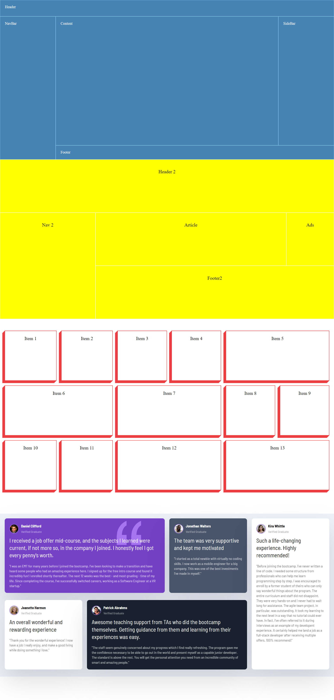

# CSS Grid Layout challenges 

In this challenge we want create layouts as giving thumbnail image

### Screenshot :
---

>

### Things i have learned working on this project :

---
1. I learned a lot about how css grid works and how to make layouts 
2. How grid helps to make 2 dimensional layouts
3. I think i have improved my googling since i used google alot whenever i was stuck in this project.
4. When to use what Grid vs Flex.
5. Aligning Items using Grid.

   
### Time took to finish the challenges :
---

It took me 2 hours to finish this project.

### About Me :
---
I'm Naveen Kumar and i am aspiring to be a Full Stack Web Developer.

### Connect with me on :
---
 

### Feedback :
---
If you have any feedback, please reach out to me at naveensurya064@gmail.com
